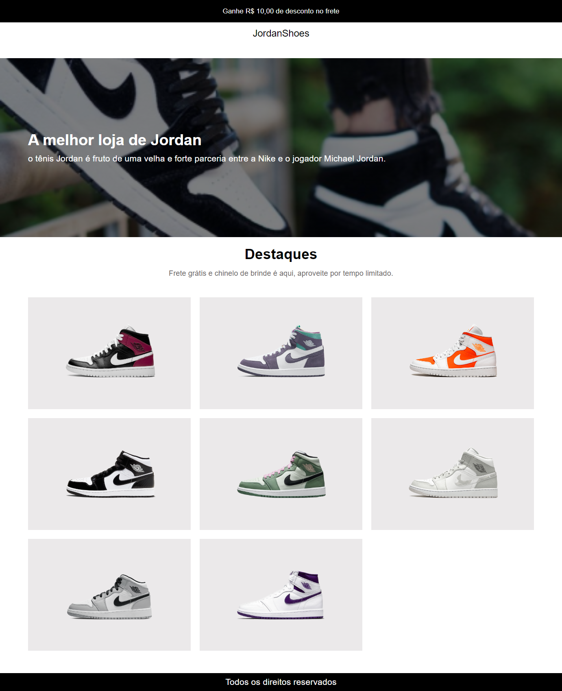

# Desafio 2 (Codelândia - JordanShoes)
Esse projeto foi desenvolvido em colaboração com a comunidade codelândia (um servidor do discord) , na qual são disponibilizados diversos layouts prontos no figma para serem desenvolvido do jeito que você quiser para fins de estudo.

>## Link do discord : 
https://discord.gg/wNCWTVuxyz
>## Link do figma com todos desafios: 
https://www.figma.com/file/Yb9IBH56g7T1hdIyZ3BMNO/Desafios---Codel%C3%A2ndia?node-id=0%3A1

# Aprendizado:
Ao desenvolver esse projeto, aprimorei meus conhecimentos sobre o conceito mobileFirst e avancei ainda mais sobre a utilização e conceitos do display grid junto ai flexbox.

# Tecnologias Usadas:
- HTML
- CSS 
- Git e Github

>## Link para visualização do projeto
https://codelandia-desafio2-jordans.netlify.app/

# Imagem do projeto (DESKTOP).

